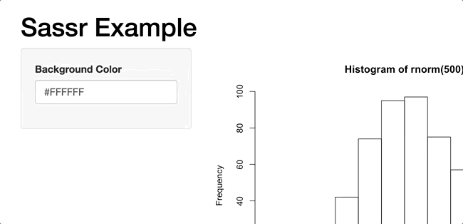

<!-- README.md is generated from README.Rmd. Please edit that file -->

# sassr

[](https://travis-ci.org/rstudio/sassr)
[](https://ci.appveyor.com/project/rstudio/sassr)

Sassr is a CSS preprocessor, letting R developers use variables,
inheritance, and functions to generate dynamic style sheets.

Sassr uses the [Sass](https://sass-lang.com/) CSS extension language.
Sass is stable, powerful, and CSS compatiable. Sassr is an R wrapper for
[LibSass](https://github.com/sass/libsass), a fast Sass compiler written
in C++.

## Installation

Install the released version of sassr from CRAN:

``` r
install.packages("sassr")
```

Install the latest development build from Github:

``` r
# install.packages("devtools")
devtools::install_github("rstudio/sassr")
```

## Getting Started

The Sass language syntax is similar to CSS, but allows functions and
variables, and can do arbitrary computations.

``` r
library(sassr)
compile_sass(text = "
  $size: 100%;
  foo { margin: $size * .33; }
")
#> foo {
#>   margin: 33%;
#> }
```

For an overview of the major features of Sass such as variables,
nesting, and imports check out the official [Sass
Basics](https://sass-lang.com/guide).

## Examples

Checkout the Sassr Example [Shiny
App](https://gallery.shinyapps.io/140-sassr-size/) and the sassr
[website](https://rstudio.github.io/sassr/articles/sass.html).

